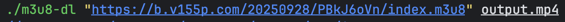
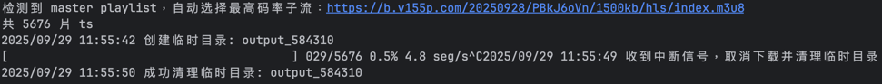

### 添加 ffmpeg
* Mac: brew install ffmpeg
* Windows: choco install ffmpeg
* linux: sudo apt install ffmpeg

### 下载 m3u8 方便工具
* 编译方式  go build -o m3u8-dl main.go  
* 使用方式 ./m3u8-dl "网址路径/档案名称.m3u8" 媒体.mp4